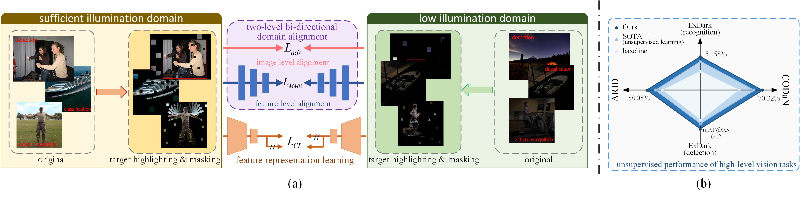
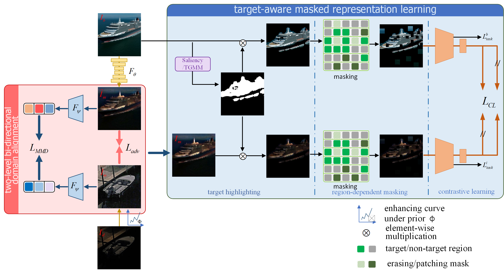

<p align="center">
    <h1 align="center"><strong>[ECCV2024] Watching it in Dark: A Target-aware Representation Learning Framework for High-Level Vision Tasks in Low Illumination</strong></h1>
    <p align="center">
        Yunan Li&emsp;
        Yihao Zhang&emsp;
        Shoude Li&emsp;
        Long Tian&emsp;
        Dou Quan&emsp;
        Chaoneng Li&emsp;
        Qiguang Miao&emsp;
        <br>
        <em>Xidian University; Xi'an Key Laboratory of Big Data and Intelligent Vision</em>
        <br>
        <br>
        <em><a href="https://github.com/ZhangYh994/WiiD" style="color:blue;">Code</a> | <a href="https://www.ecva.net/papers/eccv_2024/papers_ECCV/papers/09518.pdf" style="color:blue;">Paper</a> | <a href="https://www.ecva.net/papers/eccv_2024/papers_ECCV/papers/09518-supp.pdf" style="color:blue;">Supp</a></em>
        <br>
    </p>
</p>


<div id="top" align="center">
    This is the official implementaion of paper <b><i>Watching it in Dark: A Target-aware Representation Learning Framework for High-Level Vision Tasks in Low Illumination</i></b>, which is accepted in <b><i>ECCV 2024</i></b>. In this paper, we propose a target-aware representation learning framework designed to improve high-level task performance in low-illumination environments. We achieve a bi-directional domain alignment from both image appearance and semantic features to bridge data across different illumination conditions. To concentrate more effectively on the target, we design a target highlighting strategy, incorporated with the saliency mechanism and Temporal Gaussian Mixture Model to emphasize the location and movement of task-relevant targets. We also design a mask token-based representation learning scheme to learn a more robust target-aware feature. Our framework ensures compact and effective feature representation for high-level vision tasks in low-lit settings. Extensive experiments conducted on CODaN, ExDark, and ARID datasets validate the effectiveness of our approach for a variety of image and video-based tasks, including classification, detection, and action recognition.
</div>


<div style="text-align: center;">
    
</div>


## 👀TODO

- [x] First Release.
- [ ] Release Code of Image Classification.
  - [x] ResNet18 on CODaN
  - [ ] ResNet50 on COCO&ExDark

- [x] Release Code of Object Detection.
- [ ] Release Code of Action Recognition.


## 🌏 Pipeline of WiiD

<div style="text-align: center;">
    
</div>


## 📚 Dataset

| **Original Data**                                            |
| ------------------------------------------------------------ |
| [Common Objects Day and Night (CODaN)](https://github.com/Attila94/CODaN) |
| [Exclusively Dark Image Dataset (ExDark)](https://github.com/cs-chan/Exclusively-Dark-Image-Dataset) |
| [The PASCAL Visual Object Classes (VOC)](http://host.robots.ox.ac.uk/pascal/VOC/) |
| [Microsoft Common Objects in Context (COCO)](https://cocodataset.org/#download) |
| [normal light data of action recognition(CVPR'22 UG2 challenge)](https://huggingface.co/datasets/Lin-Chen/ShareGPT4V/blob/main/sharegpt4v_mix665k_cap23k_coco-ap9k_lcs3k_sam9k_div2k.json) |
| [low light data of action recognition(ARID dataset)](https://drive.google.com/file/d/10sitw9Mi9Gv1jMfyMwbv78EZSpW_lKEx/view) |
| **Processed Data**                                           |
| [Preprocessed CODaN Dataset](https://drive.google.com/drive/folders/1d0rs9w4iVBL9PF370ciAmOogSAaqJVqe?usp=drive_link) |
| ...                                                          |

                                                  |


## 🐒 Model Zoo

| Object Detection                                             |
| ------------------------------------------------------------ |
| [Pre-Trained YOLOv5m](https://github.com/ultralytics/yolov5/releases/download/v7.0/yolov5m.pt) |
| [CUT Darken Model](https://github.com/taesungp/contrastive-unpaired-translation) |
| **Image Classification**                                     |
| [Our Pre-trained Model](https://drive.google.com/file/d/1NRU4AUS6seK9tYQGXFTdM1vg6BDRnkPS/view?usp=drive_link) |
| [ResNet-18 Baseline](https://drive.google.com/file/d/1h2h5IMXGZvw9IkYHebBFKbarFZJdp7wn/view?usp=drive_link) |
| [CUT Darken Model](https://github.com/taesungp/contrastive-unpaired-translation) |
| **Action Recognition**                                       |
| ...                                                          |


## 💻 Code

### 🕴️Object Detection

#### Dataset Preparation

We utlized the VOCO dataset(part of the [VOC](http://host.robots.ox.ac.uk/pascal/VOC/) dataset and [COCO](https://cocodataset.org/#download) dataset. The exact composition can be found in [Supplementary](https://www.ecva.net/papers/eccv_2024/papers_ECCV/papers/09518-supp.pdf), and we will also **be uploading our training data** in a few days), you can apply the [Zero-DCE](https://github.com/Li-Chongyi/Zero-DCE) method to enhance low-light data in the test night folder. For darkening the data in the train folder, you may either train the [CUT](https://github.com/taesungp/contrastive-unpaired-translation) model yourself using unpaired normal-light and low-light data for darkening the normal-light data, or directly use our [pre-trained model parameters](https://drive.google.com/file/d/1O-Hz28IjJ2ci_dAvY_QmDIb32CQZCGSq/view?usp=drive_link).

#### Model Preparation

We use the [pre-trained YOLOv5m](https://github.com/ultralytics/yolov5/releases/download/v7.0/yolov5m.pt) model. You can directly place it in the `./weights` folder.

#### Training

You can run the following command to train the model: 

```sh
python train_byol.py --weights weights/yolov5m.pt --cfg models/yolov5m.yaml --data data/Exdark_night.yaml --batch-size 8 --epochs 30 --imgsz 608 --hyp data/hyps/hyp.scratch-high.yaml --back_ratio 0.3 --byol_weight 0.1. 
```

`--back_ratio` is used to specify the background occlusion ratio.  `--byol_weight` is used to specify the weight for contrastive learning.

#### Evaluation

You can run the following command to validate the model: 

```sh
python val.py --data data/Exdark_night.yaml --batch-size 8 --weights runs/train/exp1/weights/best.pt --imgsz 608 --task test --verbose
```


### 🐱Image Classification	

#### ResNet18 on CODaN

##### Dataset Preparation

We utilized the  [CODaN](https://github.com/Attila94/CIConv)  dataset, you can apply the [Zero-DCE](https://github.com/Li-Chongyi/Zero-DCE) method to enhance low-light data in the `test_night` folder. For darkening the data in the `train` folder, you may either train the [CUT](https://github.com/taesungp/contrastive-unpaired-translation) model yourself using unpaired normal-light and low-light data for darkening the normal-light training data, or directly use our [pre-trained model parameters](https://drive.google.com/file/d/1O-Hz28IjJ2ci_dAvY_QmDIb32CQZCGSq/view?usp=drive_link).

Of course, you can download our [preprocessed CODaN dataset](https://drive.google.com/drive/folders/1d0rs9w4iVBL9PF370ciAmOogSAaqJVqe?usp=drive_link) directly and put it under `./classification/resnet18/data/`. In this version, the `test_night_zdce` folder contains data that has been enhanced for low-light conditions using Zero-DCE, and the `train_day2night` folder contains data darkened.

##### Models Preparation

We use a [pre-trained ResNet-18](https://drive.google.com/file/d/1h2h5IMXGZvw9IkYHebBFKbarFZJdp7wn/view?usp=drive_link) as the baseline, which you can download and place in `./classification/resnet18/checkpoints/baseline_resnet`.

##### Training

Run `train.sh` in `./classification/resnet18` or the following command to start training:

```sh
python train.py --use_BYOL \
  --checkpoint  'checkpoints/baseline_resnet/model_best.pt' \
  --experiment  'your_own_folder'
```

 Use `--checkpoint` to specify the pre-trained model and `--experiment` to set the storage location for model checkpoints and logs.

Our training log is provided in `./classification/resnet18/checkpoints/our_train_log.txt`, which you can use as a reference.

##### Evaluation

Run `test.sh` in `./classification/resnet18` to evaluate the model's performance or to validate our [pre-trained model](https://drive.google.com/file/d/1NRU4AUS6seK9tYQGXFTdM1vg6BDRnkPS/view?usp=drive_link).

```sh
python test.py  --checkpoint 'checkpoints/train/model_best.pt'
```

#### ResNet50 on COCO&ExDark

coming soon


### ⛹️Action Recognition

coming soon
